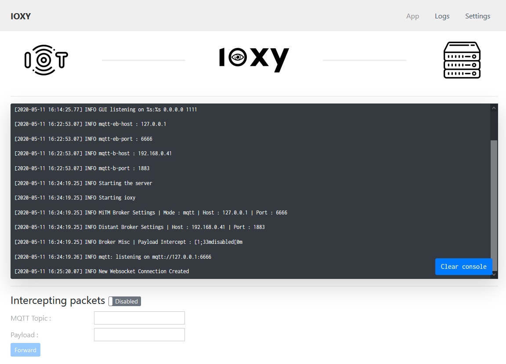
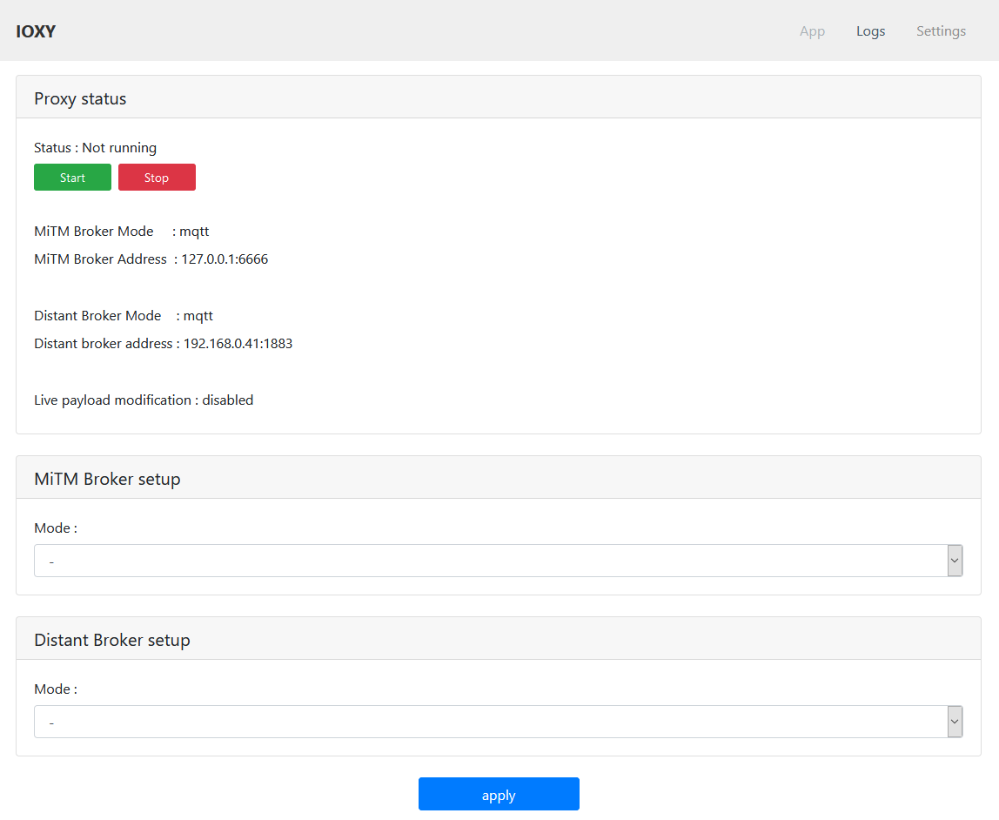
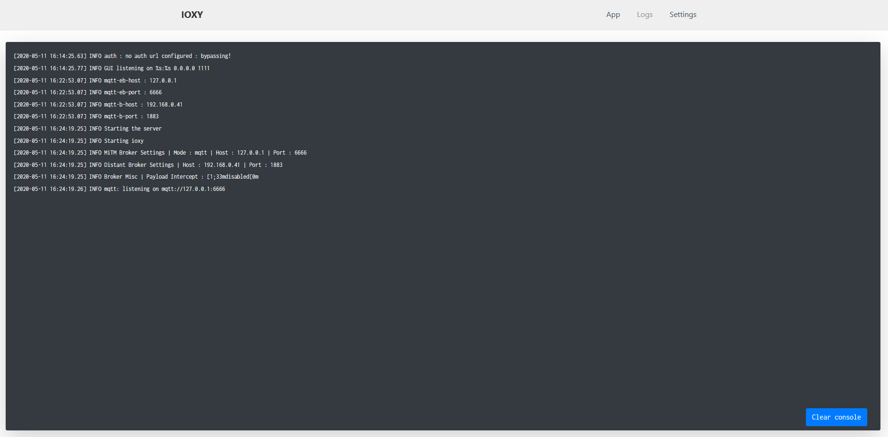
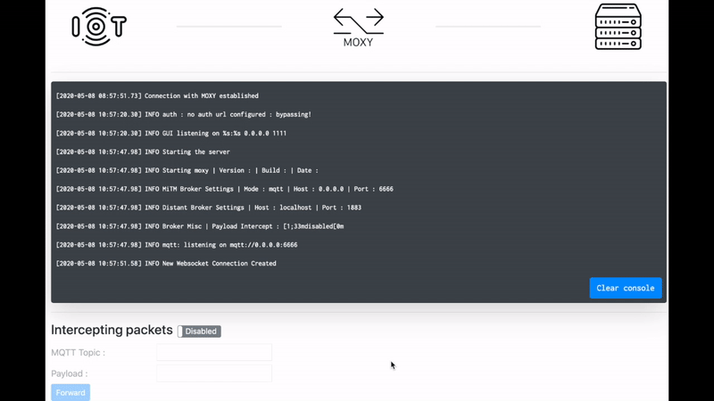

# IOXY - MQTT intercepting proxy

## What?

IOXY (IoT + Proxy) is an MQTT intercepting proxy written in Golang. It supports MQTT, MQTTS and MQTT over WebSockets and has both a CLI and a GUI.

## Why?

We frequently perform security assessment on IoT devices using MQTT to communicate with their backend. We wanted a tool that allows us to intercept, inspect and tamper with MQTT communications with the same ease as other intercepting proxies, like Burp and Zap, do for HTTP.

This is why we started working on IOXY. We put a lot of effort in this tool, and hope it will be useful to the community!

## Quick start

> ⚠️ IMPORTANT NOTE ⚠️
>
> If you are using **Windows** to compile IOXY you might need to install TDM-GCC(http://tdm-gcc.tdragon.net/download)

The only prerequisite for using IOXY is a [working Golang environment](https://golang.org/doc/install). The steps below install Golang and build the IOXY binary, and have been tested on clean installation of Kali Linux (2022.03 x64):

```bash
sudo apt update && sudo apt install -y golang-go
git clone https://github.com/NVISOsecurity/IOXY.git
cd IOXY/ioxy
CGO_CFLAGS="-g -O2 -Wno-return-local-addr" go build -ldflags="-s -w" .
./ioxy gui
```

> ⚠️ NOTE ⚠️
>
> On some architectures, compiling with the default Golang compiler causes a "panic: runtime error" crash when attempting to run IOXY. In case that happens, uninstall golang-go and install the gccgo-go compiler (sudo apt --purge autoremove golang-go & sudo apt install gccgo-go), then repeat the "go build" step. This should fix the crash. See https://github.com/NVISOsecurity/IOXY/issues/11 .

Finally, fire up the GUI and use the Settings screen to set up the intercepting server:

    ./ioxy gui

## CLI

```
Usage : ioxy ACOMMAND BCOMMAND [CCOMMAND] [DCOMMAND]

[] = optional

ACommands:
  mqtt	  	Create a mqtt server (0.0.0.0:1883 by default)
  mqtts	  	Create a mqtts server (0.0.0.0:8883 by default)
  http	  	Create a http server (0.0.0.0:8080 by default)
  https	  	Create a https server	(0.0.0.0:8081 by default)

BCommands :
  broker  	Used to set up the distant broker settings

CCommands :
  mitm-opt 	Mitm options like intercept

DCOMMAND :
  gui

Run 'ioxy COMMAND -h' for more information on a command.
```

## Examples

Check the examples below for a walkthrough on IOXY's features.

### AWS

- [AWS PubSub ALPN RolePlay](https://github.com/NVISO-BE/IOXY/tree/master/examples/aws/aws_pub_sub_case)

## Features

Below you'll find a quick overview of the features provided by IOXY. Legend:

✅ Implemented, tested <br>
❓ Implemented, not tested

- Gui ✅

<p float="left">
        
        
        
</p>

- Packet storing in SQLite Database ✅

        Tables
        ├── session_mgmt
        │   ├── client_id
        │   ├── session_id
        │   ├── username
        │   └── password
        └── messages
            ├── session_id
            ├── topic
            ├── payload
            ├── dup_flag
            ├── retain_flag
            ├── qos_flag
            └── timestamp

- Live packet modification ✅



- Amazon ALPN support ✅

## Supported Protocols

- Client → Proxy

  ✅ MQTT<br>
  ✅ MQTTS<br>
  ❓ HTTP (WebSocket)<br>
  ❓ HTTPS (Secure WebSocket)

- Proxy → Broker

  ✅ MQTT<br>
  ✅ MQTTS<br>
  ❓ HTTP (WebSocket)<br>
  ❓ HTTPS (Secure WebSocket)

## Bugs and contributions

Found a bug? Have an idea for a new feature? Please create an issue. We are monitoring the issue tracker and will follow up on any bug reports or new feature requests. More detailed information about code contributions to IOXY will be available soon.

## Acknowledgments

This project was made possible thanks to [Innoviris](http://innoviris.be/) and [SCRATCh](https://scratch-itea3.eu/), an [ITEA3](https://itea3.org/) project.


Axway's ["mqtt-proxy" repo](https://github.com/Axway-API-Management-Plus/mqtt-proxy) provided a solid base for this project.
IOXY's GUI uses ["Gorilla WebSocket"](https://github.com/gorilla/websocket).

## Authors

- **Julian Dotreppe** (hutchYy) - _Initial work_
- Cédric Bassem (cbassem) - Maintainer
- Théo Rigas (windBlaze) - Maintainer

## Useful resources and documentation

#### Network Attacks GitHub

- [Network Attacks Repository](https://github.com/rmusser01/Infosec_Reference/blob/master/Draft/Network_Attacks.md#mqtt)

#### SANS

- [SSL MITM](https://www.sans.org/reading-room/whitepapers/threats/ssl-man-in-the-middle-attacks-480)

#### AWS

- [AWS best practices](https://docs.aws.amazon.com/iot/latest/developerguide/security-best-practices.html)

- [AWS CA + client mgmt](https://docs.aws.amazon.com/iot/latest/developerguide/server-authentication.html#server-authentication-certs)

- [ALPN](https://aws.amazon.com/fr/blogs/iot/mqtt-with-tls-client-authentication-on-port-443-why-it-is-useful-and-how-it-works/)

- [Client cert generation](https://docs.aws.amazon.com/iot/latest/developerguide/create-device-certificate.html)

- [Just-in-time registration](https://aws.amazon.com/fr/blogs/iot/just-in-time-registration-of-device-certificates-on-aws-iot/)

- [IoT SDK](https://docs.aws.amazon.com/iot/latest/developerguide/iot-sdks.html)

#### MQTT[.]org

- [MQTT $SYS Topics](https://github.com/mqtt/mqtt.github.io/wiki/SYS-Topics)

#### MQTT-PWN

- ["mqtt-pwn" Repository](https://github.com/akamai-threat-research/mqtt-pwn)

#### Other

- [MQTT Session establishement](https://www.hivemq.com/blog/mqtt-essentials-part-3-client-broker-connection-establishment/)
- [Hacking The IoT](https://morphuslabs.com/hacking-the-iot-with-mqtt-8edaf0d07b9b)
