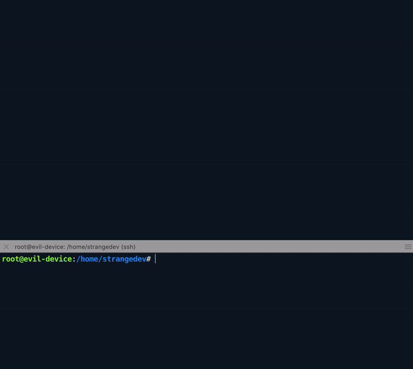

# AWS ALPN Example
⚠️ **The following example shows how to set up IOXY in a complicated use-case of MQTTS using certificate-based authentication in AWS.**<br>

The example doesn't use all the features of [IOXY](https://github.com/NVISO-BE/IOXY), like live message interception, but feel free to try them :)

## Setup

Today, we were scanning our network and found a strange device (evil-device). We also found that its SSH port is open and that we can get a root shell by entering some generic credentials. 

> Tip: in case MQTTS is used, to use IOXY you'll need to have root access on the target device, 
> except if it is misconfigured :)

## Analysis
We looked in every folder and the only interesting thing we found is this :

    strangedev/
    ├── certs
    │   ├── AmazonRootCA1.pem
    │   ├── aws_evil.crt
    │   └── aws_evil.key
    ├── evilPubSub.sh
    └── pubsub.py
    
Let's take a closer look at each file:

* pubsub[.]py

Simple pub-sub client from AWS.
You can take a sneak peek over [here](https://github.com/aws/aws-iot-device-sdk-python-v2/blob/master/samples/pubsub.py).

* evilPubSub[.]sh 

Just a startup script:

```Bash
python3 pubsub.py \
	--endpoint evil-ats.iot.eu-west-3.amazonaws.com \
	--root-ca certs/AmazonRootCA1.pem \
	--cert certs/aws_evil.crt \
	--key certs/aws_evil.key \
	--count "$1" # Number of payload to send
```

#### Behaviour

    ./evilPubSub 1
    Connecting to evil-ats.iot.eu-west-3.amazonaws.com with client ID 'evil-client-id'...
    Connected!
    Subscribing to topic 'evil/rock'...
    Subscribed with QoS.AT_LEAST_ONCE
    Sending 1 message(s)
    1 message(s) received.
    Disconnecting...
    Disconnected!

We notice that the device is trying to send / receive messages on evil/rock topic.

## Using IOXY

After some analysis, we know that the evilPubSub sends MQTT messages on AWS. It would be very interesting to read the messages.<br>
Happily, a friend of us developed an awesome tool called [IOXY](https://github.com/NVISO-BE/IOXY) to intercept MQTT messages stealthily.

### Downloading the AWS client's certificate & key

IOXY will provide a termination point for the TLS session initiated from evil-device and will also initiate a new TLS session with the AWS MQTT broker. It will forward messages between the two sessions. 

In order to be able to authenticate to the AWS broker, we must provide IOXY with the client certificates and keys found of the IoT device. So, we download them from evil-device:

``` Bash
# Start a http server on port 1111
root@evil-device:/home/strangedev/certs
➜ python3 -m http.server 1111

# Download certs on the proxy machine
hutchyy@hutchyy-VM:~/aws_evil_analysis
➜ wget -r [evil-device_ip:1111]

hutchyy@hutchyy-VM:~/aws_evil_analysis
➜ tree [evil-device_ip:1111]

[evil-device_ip:1111]
|-- AmazonRootCA1.pem
|-- aws_evil.crt
`-- aws_evil.key
```

### Setting up the proxy

We can easily obtain IOXY by cloning the repo and by using the power of Golang:

    git clone https://github.com/NVISO-BE/IOXY
    cd ~
    cd ioxy/ioxy && go build .

### Configuring the strange device

We must now replace the certificates on the IoT device with those generated by IOXY. 

> Tip: IOXY comes with some pregenerated certificates for this use, but inside the certs folder
> you'll also find instructions to generate your own.

```Bash  
# Here is the tree
# <- is used by

hutchyy@hutchyy-VM:~/ioxy/ioxy/
➜ tree certs/

certs
|-- ca
|   |-- rootCA.key
|   `-- rootCA.pem  <- evil-device && ioxy
|-- devices
|   `-- d1
|       |-- d1.csr
|       |-- d1.key  <- evil-device
|       `-- d1.pem  <- evil-device
|-- README.md
`-- verificationCert
    |-- verificationCert.csr
    |-- verificationCert.key  <- ioxy
    `-- verificationCert.pem  <- ioxy
```

``` Bash
# Start a http server on port 1111
hutchyy@hutchyy-VM:~/ioxy/ioxy/certs/
➜ python3 -m http.server 1111

# Download client certs on the proxy machine
root@evil-device:/home/strangedev/certs
➜ wget -r [hutchyy_ip:1111]/devices/d1

# Download the CA cert
root@evil-device:/home/strangedev/certs
➜ wget [hutchyy_ip:1111]/ca/rootCA.pem
```

### MiTM TIME !

We are fully ready now to start intercepting.

#### On evil-device: make it connect to our proxy
```Bash
# Modifying hosts file to resolve wanted name
echo "[hutchyy_ip]    ioxy.mqtt" >> /etc/hosts

# Ioxy certs tree
root@evil-device:/home/strangedev/
➜ tree [hutchyy_ip:1111]/

[hutchyy_ip:1111]/
├── ca
│   └── rootCA.pem <- evil-client
└── devices
    └── d1
        ├── d1.csr
        ├── d1.key  <- evil-client
        └── d1.pem  <- evil-client

# Modifying evilPubSub.sh to connect on our MQTT proxy (ioxy)
python3 pubsub.py \
	--endpoint  ioxy.mqtt \
	--root-ca   [hutchyy_ip:1111]/ca/rootCA.pem \
	--cert      [hutchyy_ip:1111]/devices/d1/d1.pem \
	--key       [hutchyy_ip:1111]/devices/d1/d1.key \
	--count     "$1" # Number of payload to send
```

#### On our VM where IOXY is installed
``` Bash
# Set env var to make ioxy command cleaner
AWSCRT = ~/aws_evil_analysis/[evil-device_ip:1111]/aws_evil.crt     && \
AWSKEY = ~/aws_evil_analysis/[evil-device_ip:1111]/aws_evil.key     && \
IOXYCA = ~/ioxy/ioxy/certs/verificationCert/verificationCert.pem    && \
IOXYCRT = ~/ioxy/ioxy/certs/verificationCert/verificationCert.pem   && \
IOXYKEY = ~/ioxy/ioxy/certs/verificationCert/verificationCert.key   && \
AWSEND = evil.iot.eu-west-3.amazonaws.com

# Start ioxy
hutchyy@hutchyy-VM:~/ioxy/ioxy/
➜ sudo ./ioxy                       \
    mqtts                           \
    -mqtts-port         443         \
    -mqtts-cert         $IOXYCRT    \
    -mqtts-key          $IOXYKEY    \
    -mqtts-ca           $IOXYCA     \
    broker                          \
    -mqtt-broker-tls                \
    -mqtt-broker-host   $AWSEND     \
    -mqtt-broker-port   443         \
    -mqtt-broker-cert   $AWSCRT     \
    -mqtt-broker-key    $AWSKEY     \
    -x-amzn-mqtt-ca

[2020-03-17 12:19:14.283053739]  INFO Intercept : disabled
[2020-03-17 12:19:14.286094888]  INFO Starting mqtt-proxy @
[2020-03-17 12:19:14.286201998]  INFO Mode : mqtts
[2020-03-17 12:19:14.286232206]  INFO Broker :  evil.iot.eu-west-3.amazonaws.com 443
[2020-03-17 12:19:14.286247846]  INFO auth : no auth url configured : bypassing!
[2020-03-17 12:19:14.327314872]  INFO mqtts: listening on mqtts://0.0.0.0:443
```

#### On evil-device
```Bash
# Starting evilPubSub.sh
./evilPubSub.sh 1
```
## Results



🎉 Yay !! We are intercepting!


1. The evil-device subscribed on evil/rock
2. The evil-device sent "rocks are big stones but nothing more" to the broker on the evil/rock topic
3. The evil-device received its own message because it sent it in a subscribed topic
4. The evil-device disconnected

> Tip: if you want to use the GUI instead of the CLI, just add "gui" at the end of IOXY command we 
> showed you above. It will automatically load the provided configuration for you and start the gui.

## Afterthoughts

Now everything is clear !<br>
This isn't an evil-device it's just my orangePi. <br><br>
I just remember that a few months ago, I planned to climb the Mont Blanc and I wanted to have my orangePi (evil-device) with me. But why would you ask ! To communicate on AWS so my family could follow me in my journey. This was before I noticed that there is not WiFi Access Point on the Mont Blanc \*sad\*.<br>

Now that we resolved the case, should I go to the Mont Blanc and add some WiFi AP or should I just stop my project ? \*thinking\*